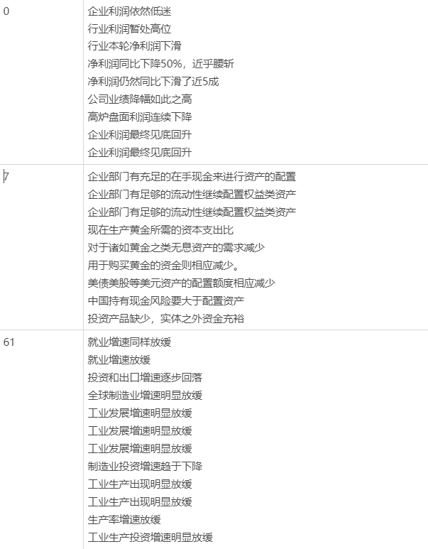
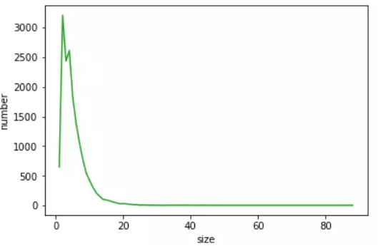
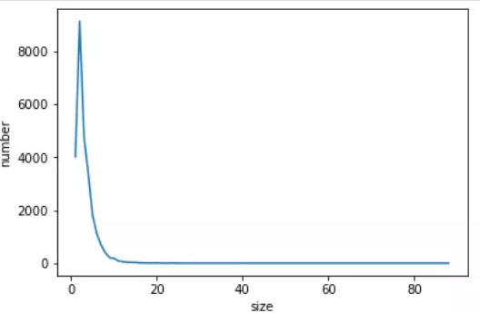
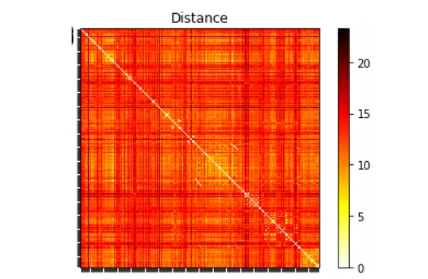
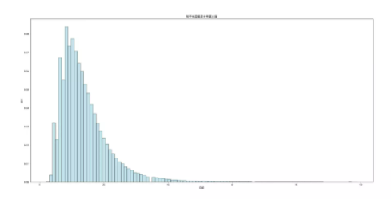
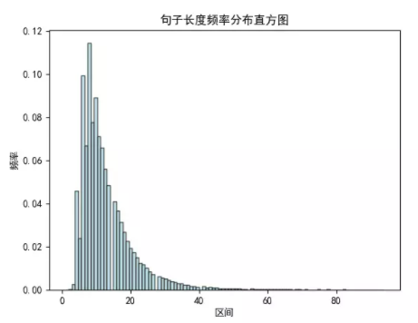
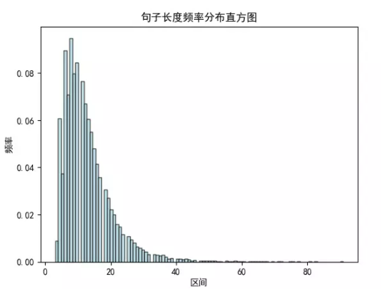

# Financial-Event-Extraction-Program(Chinese Datasets)
> ***This project deals with financial datasets in Chinese!***

### Task breakdown:

#### 1. Get financial news

- Open source dataset：
  - SmoothNLP financial news dataset samples （20k）
- The news dataset obtained by the crawler:
  - Financial News Network data (67908)
  - Futures Network Data (16318)

#### 2. Pattern matching

- Input: 

  - Directly obtained financial news text

- Output: 

  - raw_event_sent.txt. Format per line (doc_id, sen_id, cause_b, cause_e, effect_b, effect_e, trigger1_b, trigger1_e, trigger2_b, trigger2_e,...)

  - eg: 13 8 473 556 0 35 38 83 36 38

- The main idea is to divide the news text into sentences, word segmentation (jieba), and part-of-speech tagging (Ltp). 10 kinds of rules are formulated, firstly identify keywords, then use string matching to intercept the cause and effect in the text, and then return the index position of the cause and effect in the sentence.

- Note: 
  -  The re library is used. Due to its intrinsic function, the index of individual causes, effects and keywords cannot be found, so it is represented by -1.
  - In this step, all sentences with causal relationship cannot be found, mainly i. There are no clear keywords, ii. There are keywords that do not meet the specified 10 rules

#### 3. Neural network 

- The idea here is to find some candidate samples through the pattern, and then manually verify each one to generate a high-quality training sample set.

- Model structure
  - **pre-trained BERT not finetune**
  - **BILSTM * 3 layers hidden_state=128**
  - **CRF**

- Results
  - For extraction results(129): 
    - precision = 61.6%, recall = 82.6% 
    - recall = Among all the events extracted by people in these 129 pieces of data, the number of events extracted by the machine and made sense / the total number of events extracted by people.
    - precision = the number of events/total number of events that make sense in all events extracted by the model in these 129 pieces of data
  - For causal pairs (from 50 sentences)(100):
    - precision = 57.8%, recall = 77.1%
    - recall = all causal relationship pairs extracted by people in these 100 pairs of data, the number of causal pairs extracted by the machine and make sense / the total number of causal pairs extracted by people.
    - precision = causal pairs/total number of make sense among the causal pairs extracted by the model in these 100 pieces of data
- The precision calculated according to the above precision/recall formula is actually low, because as in the above sentence, manual annotation often only indicates: [Foreign exchange reserves are more concentrated in the hands of the private sector] or [The foreign exchange transaction volume in the private swap market gradually exceeds The official market], and the three extraction results are actually different representations of the same event, all of which are correct, but only one of them may be correct in the formula.

#### 4. Clustering

- After using bert embedding to calculate the average of each dimension, using Euclidean distance, the threshold is 12/10, and the result of clustering the futures network events, 16123/26051 clusters. It doesn't feel good, the main ones that are grouped together have the same words.

  - For example: when t=12
  - 

- The size distribution of clusters

  - The average size of t=12 is about 5.1, and there are 10 classes with a size greater than 40. The largest two classes: the class with size=88 is 8075: "the devaluation of the RMB"; the class with size=80 is 10283: "the dollar is strong", They are literally identical and derived from several different articles. However, the clustering effect of large-sized classes is not good. For example, class 1114, size=40, is very confusing, especially when the events are relatively long.
  - 
  - The average size of t=10 is about 3.2, and the smaller t has a greater impact on the class with small size: the number of sizes 1 and 2 changes from 650 3209 to 4020 9130.
  - 

- Distance distribution

  The Euclidean distance between events, with dark "grid lines" showing that many events are farther away from all other events. This is the bert-embeding (average of each dimension) of the futures network event.

  

- After trying threshold=5, 80,000 events gathered into more than 60,000 categories, but they couldn't gather, so they gave up. Instead, the results with threshold=10 were filtered with (distance between any two events within the class < 5) and (size of the class > 1) and (the event index span within the class was greater than 10: meaning at least two articles). 

  Total: 1529 categories 6619 events accounting for 11.70% of the original events.
  If it is a knowledge graph, it can be considered that these events are more important, have extensive influence, and have high credibility. I think the effect of this clustering idea is the same at present, and we can't simply use the Euclidean distance clustering of Bert-embedding...

- The problems are: 
  -  The original data articles are very likely to be repeated. For example, the articles in several web pages are exactly the same. Such incidents have been counted many times. The exact same expression of "demand for vibration methanol" has been repeated 19 times, word for word, it is unlikely. 
  - Antonym situation: such as: [(15651, 'The Canadian dollar exchange rate weakens'), (35104, 'The Canadian dollar exchange rate weakens'), (36242, 'The Canadian dollar exchange rate weakens'), (52923, 'The Canadian dollar exchange rate strengthens' ), (52965, 'The Canadian dollar exchange rate is strong'), (53579, 'The Canadian dollar exchange rate has weakened'), (65236, 'The Canadian dollar exchange rate has weakened')] Because the event embedding is to obtain the average of each word, the importance of each word is not considered to varying degrees.

#### 5. Data analysis

- Financial News Network news is not clustered (only exact match):

  - entity: 486708
  - pair: 385153
  - average length: 13.81
  - Sentence length distribution:
  - 

- Futures news is not clustered (only exact match)

  - entity: 66329
  - pair: 41308
  - average length: 12.89
  - Sentence length distribution:
  - 

- Smoothnlp news is not clustered (only exact match)

  - entity: 56834

  - pair: 41018

  - average length: 12.85

  - Sentence length distribution:

  - 

    
